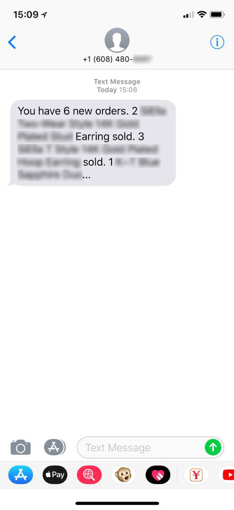
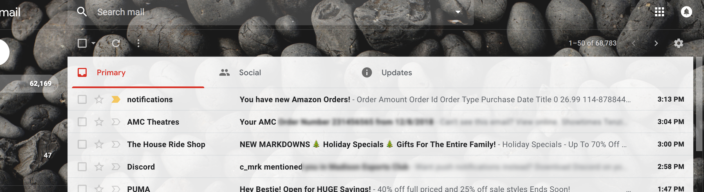

# anoti: Amazon Order Notifications Customized For Your Needs
anoti is a python3 application built for amazon sellers who
need a more responsive, customizable alert system for their orders.

## Text/SMS Alerts

## Email Alerts

# Installation
anoti uses the following stacks and services

* twilio to send SMS
* zohomail to serve emails
* digitalocean for cloud computing platform and DNS
* sqlite3 database to store orders
* docker to containerize multiple instances of the application

If any of this is a foreign language to you, you most likely need a developer's
help getting all of this setup. Reach me directly @tchoedak <tchoedak@gmail.com>
to get my services in setting this all up.
